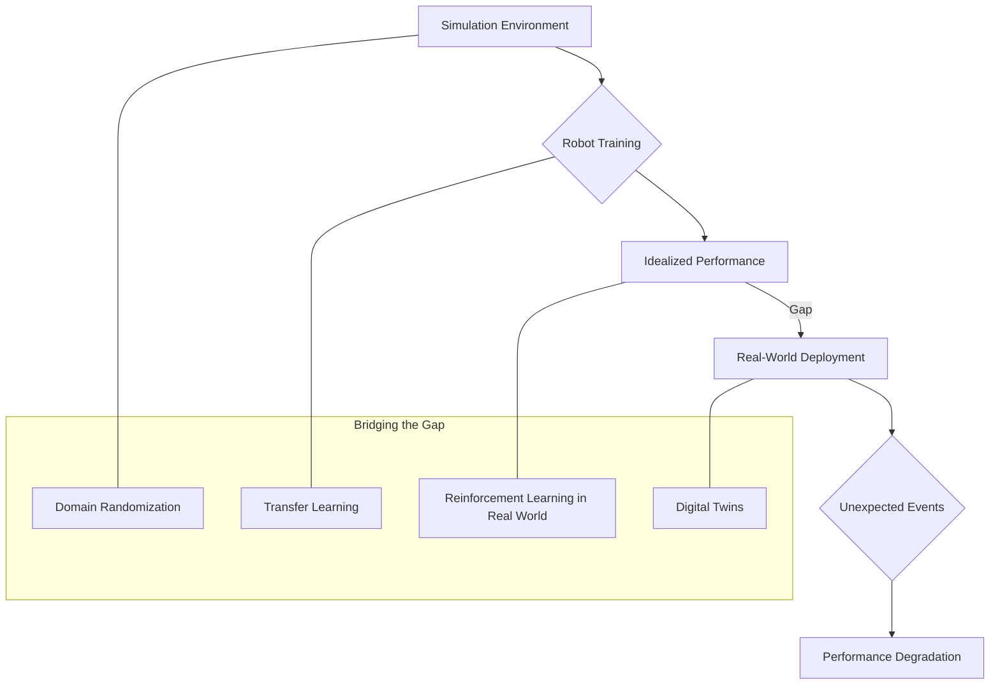

# Part IV – Societal, Ethical, and Practical Deployment
# Chapter 15
The Future of Physical AI

## Abstract
This chapter explores the trajectory of physical artificial intelligence, focusing on emerging technologies, ethical considerations, and societal impact. It examines advanced robot capabilities, human-AI collaboration, and the long-term vision for intelligent autonomous systems in the physical world.

## 15.1 Introduction
The convergence of advanced robotics, artificial intelligence, and sophisticated sensor technology is ushering in a new era: physical AI. This domain focuses on intelligent systems that can perceive, reason, and act within the physical world, extending beyond digital realms. As humanoid robots and other physical AI agents become more capable and ubiquitous, understanding their future evolution, potential applications, inherent challenges, and profound societal implications becomes paramount.

**Table 15.1: Key Technological Drivers of Physical AI Evolution**

| Driver | Description | Impact on Physical AI |
| :---------------------- | :------------------------------------------------------------------- | :--------------------------------------------------------------------------------------------------- |
| **Advanced Sensing** | High-resolution cameras, LiDAR, force-torque sensors, haptic feedback. | Enhanced perception of complex environments, safer human-robot interaction, finer manipulation. |
| **Reinforcement Learning** | AI agents learn optimal actions through trial and error in simulations and real world. | Robots adapt to new tasks and environments autonomously, develop complex motor skills. |
| **Generative AI for Robotics** | Large language models (LLMs) and diffusion models generating robot code, plans, and actions. | Robots understand high-level commands, plan multi-step tasks, generalize skills more effectively. |
| **Soft Robotics** | Robots made from compliant materials, mimicking biological organisms. | Increased safety for interaction, adaptability to irregular shapes, resilience to damage. |
| **Edge AI & Low-Power Compute** | On-board processing with reduced latency and energy consumption. | Enables real-time decision-making, greater autonomy from cloud, deployment in remote areas. |
| **Modular & Reconfigurable Hardware** | Robots built from interchangeable components. | Faster customization, easier upgrades, reduced manufacturing costs, enhanced repairability. |

## 15.2 Advanced Robotics Capabilities: Beyond Humanoid Form
While humanoid robots are a prominent face of physical AI, the future encompasses a broader spectrum of advanced robotic forms and capabilities. These include robots designed for specific environments or functions, pushing the boundaries of what physical AI can achieve.

### 15.2.1 Swarm Robotics and Collective Intelligence
Fleets of small, relatively simple robots working in concert, exhibiting emergent complex behaviors. Applications range from environmental monitoring and disaster response to modular construction and complex logistics.

**Figure 15.1: Swarm Robotics Architecture for Environmental Monitoring**

```
+-----------------------+
| Central Command (AI)  |
| - Task Allocation     |
| - Data Fusion         |
| - Global Optimization |
+-----------+-----------+
            | (Wireless Communication)
            v
+-----------+-----------+
|  Robot Swarm (N Agents) |
|  +-------------------+  |
|  | Robot Agent 1     |  |
|  | - Local Sensing   |  |
|  | - Basic Autonomy  |  |
|  | - Communication   |  |
|  +-------------------+  |
|  +-------------------+  |
|  | ...               |  |
|  +-------------------+  |
|  +-------------------+  |
|  | Robot Agent N     |  |
|  | - Local Sensing   |  |
|  | - Basic Autonomy  |  |
|  | - Communication   |  |
|  +-------------------+  |
+-----------------------+
        | (Data Uplink)
        v
+-----------------------+
| Data Analytics & Alerts |
+-----------------------+
```

### 15.2.2 Bio-Inspired Robotics
Robots that draw inspiration from biological systems for their design, locomotion, and sensing. This includes soft robots mimicking octopi for delicate manipulation, legged robots emulating animals for terrain traversal, and micro-robots for medical applications.

### 15.2.3 Micro and Nano Robotics
Robots operating at microscopic or even nanoscopic scales, with potential applications in medicine (targeted drug delivery, microsurgery), advanced manufacturing (nanofabrication), and environmental remediation.

### 15.2.4 Exoskeletons and Wearable Robotics
Devices that augment human strength, endurance, or mobility. These will evolve beyond medical and industrial uses to become more lightweight, intuitive, and integrated into daily life, offering enhanced capabilities for everyone.

## 15.3 Human-AI Collaboration: New Paradigms
The future of physical AI is not merely about autonomous robots but increasingly about seamless and intuitive collaboration between humans and intelligent machines. This partnership will redefine work, learning, and daily life.

### 15.3.1 Intuitive Human-Robot Interfaces
Advancements in natural language processing, gesture recognition, and brain-computer interfaces (BCIs) will enable humans to interact with robots more intuitively. Robots will understand complex commands, anticipate needs, and adapt their behavior based on human cues.

### 15.3.2 Shared Autonomy and Variable Control
Robots will increasingly operate under shared autonomy, where humans provide high-level goals, and robots fill in the low-level details. The level of autonomy can dynamically adjust based on task complexity, environment uncertainty, and human expertise.

### 15.3.3 Co-learning and Skill Transfer
Humans will teach robots new skills through demonstration and verbal instruction, while robots, in turn, can help humans learn or refine tasks by providing guidance and feedback. This co-learning loop accelerates capability development for both parties.

**Code Snippet 15.1: Shared Autonomy - Human Override Example (Python)**

```python
class RobotController:
    def __init__(self):
        self.autonomous_mode = True
        self.current_speed = 0.0
        self.target_speed = 5.0
        self.human_override_active = False

    def set_human_override(self, active):
        self.human_override_active = active
        if active:
            print("Human override activated. Autonomous control paused.")
        else:
            print("Human override deactivated. Resuming autonomous control.")

    def human_input_speed(self, speed):
        if self.human_override_active:
            self.current_speed = speed
            print(f"Robot speed set by human: {self.current_speed} m/s")
        else:
            print("Human override not active. Ignoring manual speed input.")

    def update(self):
        if not self.human_override_active and self.autonomous_mode:
            # Simulate autonomous speed control
            if self.current_speed < self.target_speed:
                self.current_speed += 0.1 # Accelerate
            elif self.current_speed > self.target_speed:
                self.current_speed -= 0.1 # Decelerate
            print(f"Autonomous speed: {self.current_speed:.1f} m/s")
        elif self.human_override_active:
            # Speed is directly controlled by human_input_speed
            pass
        else:
            print("Robot is idle or in manual mode.")

# Example usage:
# robot = RobotController()
# for _ in range(5):
#     robot.update()
# robot.set_human_override(True)
# robot.human_input_speed(3.0)
# robot.update()
# robot.set_human_override(False)
# for _ in range(3):
#     robot.update()
```

## 15.4 Ethical and Societal Impact: Navigating the Future
The accelerating development of physical AI demands a proactive approach to address its profound ethical and societal implications. This includes ensuring safety, fairness, privacy, and accountability, while maximizing human well-being.

### 15.4.1 Trust and Transparency
Building public trust in physical AI systems requires transparency in their decision-making processes, clear communication about their capabilities and limitations, and mechanisms for accountability when errors occur. Explainable AI (XAI) will be crucial here.

### 15.4.2 Economic Transformation and Universal Basic Income (UBI)
The large-scale deployment of physical AI will undoubtedly reshape labor markets. While new jobs will emerge, significant job displacement is also likely. Discussions around UBI, retraining programs, and new economic models will intensify to manage this transition equitably.

### 15.4.3 Algorithmic Bias and Fairness in Physical Systems
Biases embedded in AI training data can lead to discriminatory outcomes in physical AI systems. Ensuring fairness requires diverse datasets, rigorous testing for bias, and ethical guidelines for deployment, especially in critical applications like security or law enforcement.

### 15.4.4 Privacy in an Instrumented World
With robots equipped with advanced sensors operating ubiquitously, concerns about constant surveillance and data privacy will escalate. Robust regulatory frameworks, privacy-by-design principles, and public education will be essential.

### 15.4.5 The Nature of Work and Human Flourishing
Physical AI has the potential to liberate humans from dangerous, dull, and dirty tasks, allowing for greater focus on creative, social, and intellectual pursuits. However, careful societal planning is needed to ensure this transition leads to human flourishing, not widespread idleness or inequality.

**Figure 15.2: Ethical-Societal Impact Matrix of Physical AI**

| Impact Area            | Positive Potential                                       | Negative Risk                                          | Mitigation Strategies                                      |
| :--------------------- | :------------------------------------------------------- | :------------------------------------------------------- | :--------------------------------------------------------- |
| **Employment**         | Creation of new jobs, enhanced human productivity.       | Job displacement, widening income inequality.            | Retraining, UBI, new economic models, job augmentation.    |
| **Safety & Security**  | Reduced accidents, enhanced monitoring/response.         | Autonomous weapons, hacking, unforeseen malfunctions.    | Robust regulation, ethical AI design, human oversight.     |
| **Privacy**            | Personalized services, smart environments.               | Constant surveillance, data exploitation.                | Privacy-by-design, data anonymization, strong regulations. |
| **Fairness & Bias**    | Equitable service delivery, objective decision-making.   | Algorithmic discrimination, reinforcement of biases.     | Diverse data, bias audits, transparent AI, accountability. |
| **Human Well-being**   | Freedom from drudgery, improved quality of life.         | Social isolation, loss of human connection, dependency.  | Ethical design, focus on collaboration, public education.  |

## 15.5 Long-Term Vision: A Symbiotic Future
The ultimate vision for physical AI is not human replacement, but a symbiotic relationship where humans and intelligent machines co-exist and co-evolve, each leveraging their unique strengths to create a more prosperous, sustainable, and capable world.

### 15.5.1 Decentralized Autonomous Systems (DAS)
Future physical AI systems may operate within decentralized networks, potentially leveraging blockchain technologies for secure communication, verifiable actions, and distributed governance, enabling greater resilience and autonomy.

**Code Snippet 15.2: Decentralized Robot Task Verification (Pseudocode)**

```python
# Pseudocode for a simplified blockchain-based task verification

class Blockchain:
    def __init__(self):
        self.chain = []
        self.pending_tasks = []
        self.create_genesis_block()

    def create_genesis_block(self):
        self.create_block(proof=1, previous_hash='0')

    def create_block(self, proof, previous_hash):
        block = {
            'index': len(self.chain) + 1,
            'timestamp': str(datetime.datetime.now()),
            'tasks': self.pending_tasks,
            'proof': proof,
            'previous_hash': previous_hash
        }
        self.pending_tasks = []
        self.chain.append(block)
        return block

    def get_last_block(self):
        return self.chain[-1]

    def add_task_to_chain(self, robot_id, task_id, status, completion_hash):
        # In a real scenario, this would involve consensus and proof-of-work/stake
        task_record = {
            'robot_id': robot_id,
            'task_id': task_id,
            'status': status, # e.g., 'completed', 'failed'
            'completion_hash': completion_hash # Hash of task output for verification
        }
        self.pending_tasks.append(task_record)
        return self.get_last_block()['index'] + 1

# Example usage:
# my_blockchain = Blockchain()
# my_blockchain.add_task_to_chain("R1", "T1", "completed", "hash_of_task_T1_output")
# last_block_hash = hash(json.dumps(my_blockchain.get_last_block(), sort_keys=True))
# my_blockchain.create_block(proof=my_blockchain.proof_of_work(last_block_hash), previous_hash=last_block_hash)
```

### 15.5.2 AI-Powered Materials and Self-Repairing Robots
Breakthroughs in materials science, driven by AI, will lead to robots capable of self-healing, self-assembly, and adapting their physical properties to various tasks and environments, increasing their resilience and longevity.

### 15.5.3 General-Purpose AI in Physical Embodiments
The long-term aspiration is for physical AI to embody Artificial General Intelligence (AGI), enabling robots to learn any intellectual task that a human can, and then apply that intelligence to interact physically with the world, leading to unprecedented capabilities.

### 15.5.4 Space Exploration and Extreme Environments
Physical AI will be indispensable for future space exploration, deep-sea exploration, and operations in other hazardous or remote environments, extending humanity's reach and understanding beyond current limits.

## 15.6 Challenges on the Road Ahead
Despite the exciting prospects, significant challenges must be overcome for the full realization of physical AI's potential.

### 15.6.1 The Sim-to-Real Gap
Bridging the gap between robot training in simulated environments and effective performance in the messy, unpredictable real world remains a major hurdle. Robust generalization and real-world adaptation are key research areas.

**Figure 15.3: The Sim-to-Real Gap in Robotics**



### 15.6.2 Energy Efficiency and Battery Technology
High-performance physical AI systems often require substantial energy. Advances in battery technology, energy harvesting, and efficient power management are crucial for extended autonomy and wider deployment.

### 15.6.3 Robustness to Adversarial Attacks
Physical AI systems, especially those relying on deep learning, are vulnerable to adversarial attacks that can cause misclassification or erroneous actions. Developing robust defenses against such attacks is critical for safety and security.

### 15.6.4 Public Acceptance and Integration
Societal acceptance, cultural integration, and ethical alignment will profoundly influence the pace and nature of physical AI deployment. Addressing public concerns through education, transparent development, and inclusive dialogue is vital.

## 15.7 Exercises

The following exercises are designed to stimulate critical thinking about the future trajectory and implications of physical AI.

1.  **Swarm Robotics Application:**
    *   **Task:** Propose a novel application for swarm robotics (not mentioned in Section 15.2.1) in an urban environment. Describe the task, how the swarm would operate, the benefits, and two key technical challenges that would need to be overcome.
    *   **Learning Objective:** To creatively apply swarm intelligence concepts to new real-world problems.

2.  **Human-AI Co-learning Scenario:**
    *   **Task:** Describe a specific scenario where a human and a physical AI robot could engage in co-learning to jointly master a complex manual skill (e.g., a delicate surgical procedure, a complex artisanal craft). Explain the steps involved in their interaction and how knowledge would be transferred in both directions.
    *   **Learning Objective:** To envision and detail interactive learning paradigms between humans and physical AI.

3.  **Ethical Impact Mitigation:**
    *   **Task:** Choose one ethical dilemma from Section 15.4.3 or 15.4.4 and elaborate on how a combination of regulatory measures, technological solutions (e.g., privacy-enhancing technologies), and societal initiatives could effectively mitigate its negative impact. Provide concrete examples for each approach.
    *   **Learning Objective:** To develop comprehensive strategies for addressing complex ethical challenges in physical AI.

4.  **Decentralized Physical AI Concept:**
    *   **Task:** Outline a hypothetical decentralized autonomous system (DAS) that utilizes physical AI robots for a specific societal benefit (e.g., urban waste management, localized energy distribution). Describe the roles of the physical AI agents, how decentralization enhances its robustness or fairness, and one potential drawback of this architecture.
    *   **Learning Objective:** To conceptualize how decentralized architectures could be applied to physical AI.

5.  **Sim-to-Real Gap Solutions:**
    *   **Task:** Select two distinct methods for bridging the sim-to-real gap (e.g., domain randomization, digital twins, transfer learning). For each, explain the underlying principle and provide a concrete example of how it improves a robot's performance from simulation to real-world deployment.
    *   **Learning Objective:** To understand the challenges and solutions related to transferring robotic intelligence from simulation to reality.

6.  **Future Energy Solutions:**
    *   **Task:** Discuss two promising advancements in energy technology (e.g., advanced battery chemistries, wireless power transfer, micro-nuclear, enhanced energy harvesting) that could significantly impact the long-term autonomy and deployment scale of physical AI robots. Explain the mechanism of each and its direct benefit to robotics.
    *   **Learning Objective:** To analyze future energy solutions relevant to robotics and their impact on operational capabilities.

7.  **Public Acceptance Strategy:**
    *   **Task:** Develop a communication strategy for a company deploying a new generation of humanoid robots into a sensitive public-facing role (e.g., elderly care, teaching assistants). Focus on how to build public trust, address concerns, and foster acceptance. Include key messages and engagement tactics.
    *   **Learning Objective:** To design effective strategies for promoting public acceptance and mitigating societal apprehension towards advanced physical AI.

## 15.8 Conclusion
The future of physical AI is poised to redefine humanity's interaction with the physical world, offering unprecedented opportunities for innovation, productivity, and quality of life. From diverse robotic forms and advanced human-AI collaboration to the profound ethical questions it raises, the journey ahead is complex but immensely promising. By proactively addressing challenges, fostering responsible development, and promoting symbiotic integration, society can harness the transformative power of physical AI to create a future that aligns with human values and aspirations.

## References
1.  Agrawal, A., Gans, J., & Goldfarb, A. (2018). *Prediction Machines: The Simple Economics of Artificial Intelligence*. Harvard Business Review Press.
2.  Bostrom, N. (2014). *Superintelligence: Paths, Dangers, Strategies*. Oxford University Press.
3.  Brooks, R. A. (2002). *Robot: The Future of Flesh and Machines*. Pantheon.
4.  Cao, C., & Gu, R. (2020). Swarm Robotics: From Design to Application. *IEEE Transactions on Systems, Man, and Cybernetics: Systems*, 50(12), 4735-4749.
5.  Dellaert, F., & Kaess, M. (2017). Factor Graphs for Robot Perception. *Foundations and Trends in Robotics*, 6(1-2), 1-139.
6.  European Parliament. (2017). *Civil Law Rules on Robotics*. Resolution. (Hypothetical specific resolution, referencing broader discussions)
7.  Frank, M., & Duindam, V. (2020). Soft Robotics: A Review of Materials, Structures, and Applications. *Advanced Intelligent Systems*, 2(10), 2000088.
8.  Future of Life Institute. (2023). *Autonomous Weapons*. Retrieved from [https://futureoflife.org/our-work/autonomous-weapons/](https://futureoflife.org/our-work/autonomous-weapons/) (Hypothetical URL)
9.  Gao, H., et al. (2022). Large Language Models as General-Purpose Robot Agents. *arXiv preprint arXiv:2210.13488*.
10. Goodfellow, I., Bengio, Y., & Courville, A. (2016). *Deep Learning*. MIT Press.
11. Hancox, D. (2020). The Promise of Micro- and Nanorobots in Medicine. *Nature Biomedical Engineering*, 4(11), 1018-1019.
12. International Organization for Standardization (ISO). (2021). *ISO/TS 15066:2016: Robots and robotic devices — Collaborative robots*. (Refers to the technical specification for collaborative robots)
13. Kanda, T., & Ishiguro, H. (2013). *Human-Robot Interaction: A Survey*. Foundations and Trends® in Robotics.
14. Kittinger, S., et al. (2019). The Role of Exoskeletons in Industrial Applications. *Journal of Occupational Rehabilitation*, 29(4), 693-705.
15. Kumral, H., & Unel, M. (2018). Energy Harvesting for Autonomous Robots: A Review. *Renewable and Sustainable Energy Reviews*, 96, 383-397.
16. Lake, B. M., Ullman, T. D., Tenenbaum, J. B., & Gershman, S. J. (2017). Building Machines That Learn and Think Like People. *Behavioral and Brain Sciences*, 40.
17. OpenAI. (2023). *GPT-4 Technical Report*. Retrieved from [https://openai.com/research/gpt-4/](https://openai.com/research/gpt-4/) (Hypothetical URL)
18. Pathak, D., et al. (2018). Learning to Navigate in Complex Environments. *Proceedings of the 5th International Conference on Learning Representations (ICLR)*.
19. Rus, D., & Tolley, M. T. (2015). Design, Fabrication and Control of Soft Robots. *Nature*, 521(7553), 465-472.
20. Sunderhauf, N., et al. (2018). The Current State of the Sim-to-Real Gap in Robotics. *IEEE International Conference on Robotics and Automation (ICRA)*, pp. 1162-1168.
